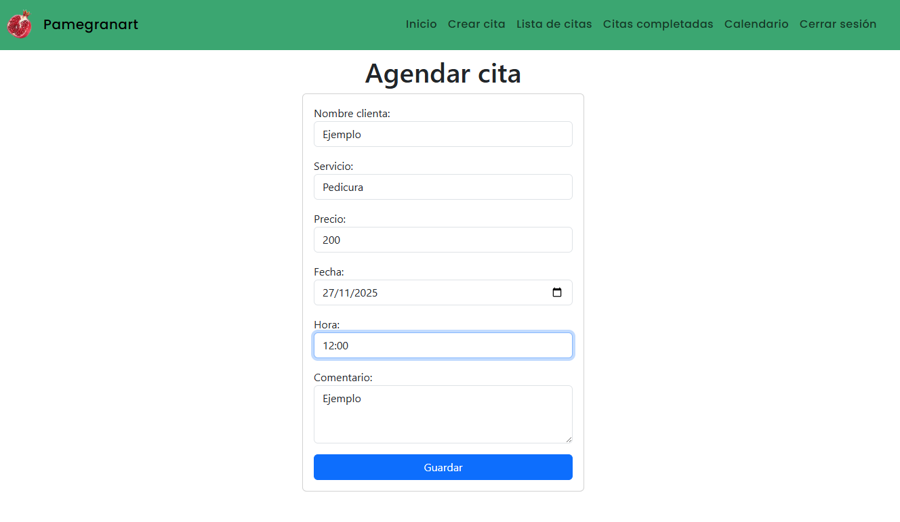
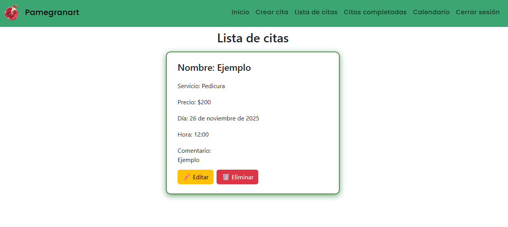
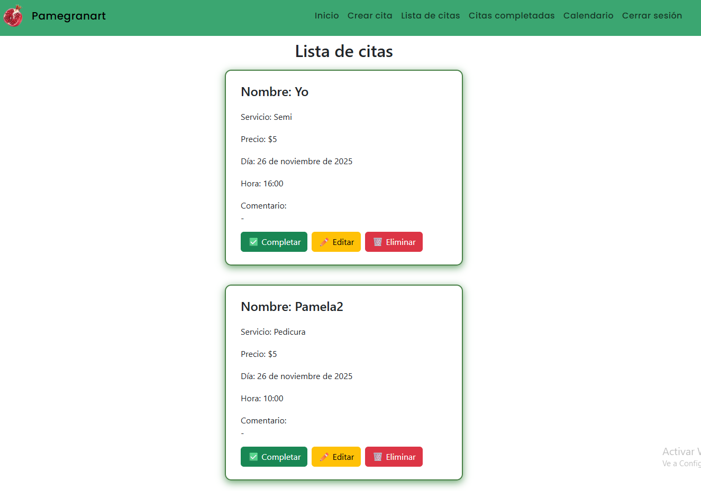
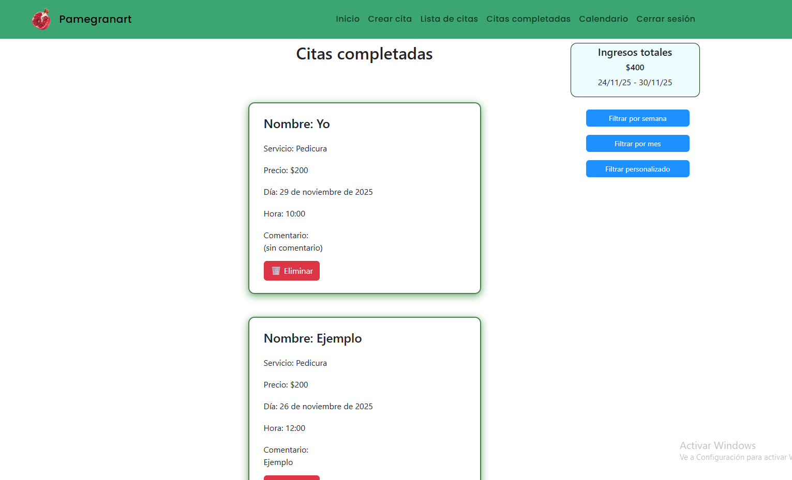
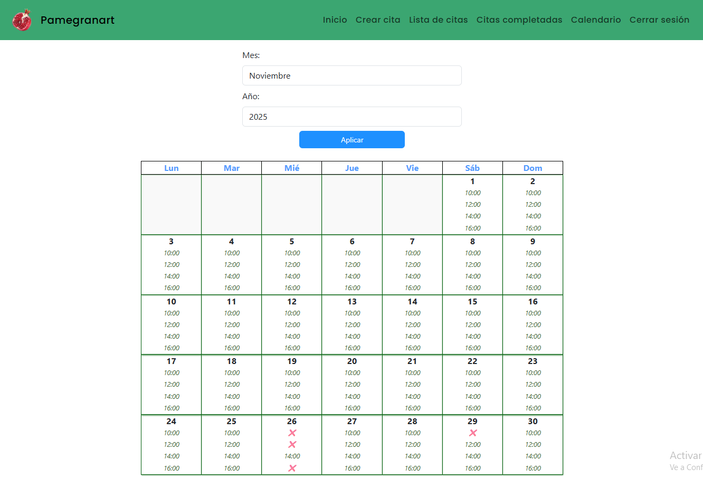

# 💅 Citas de Uñas – Agenda Digital Inteligente para Profesionales de Belleza

**Citas de Uñas** es una aplicación web creada con **Django** para gestionar turnos, horarios disponibles, clientes y calendarios mensuales de forma **simple, rápida y eficiente**.

Está diseñada especialmente para:

- Manicuristas  
- Estilistas  
- Salones de belleza  
- Profesionales independientes que trabajan con turnos  

---

## ✨ Características Principales

### 📆 Calendario interactivo con disponibilidad
- Vista mensual organizada por semanas.  
- Días y horarios ocupados marcados automáticamente.  
- Turnos libres visibles con colores y señales visuales.  
- Cálculo dinámico de horarios ocupados usando **template tags personalizados**.

---

### 🕒 Gestión completa de turnos
- Crear, editar y eliminar citas.  
- Registrar nombre del cliente, servicio, fecha y horario.  
- Validación automática que impide **turnos duplicados**.  
- Lógica para fechas válidas (mes, año, rango permitido).  

---

### 🔐 Sistema de usuarios (Login Required)
- Solo usuarios registrados pueden administrar citas.  
- Cada usuario ve **solo sus propios turnos**.  
- El superusuario puede administrar todas las citas.  
- Login, logout y protección total de vistas privadas.

---

### 🎨 Interfaz con HTML + Bootstrap
- Plantillas limpias y organizadas.  
- Estilos modernos con **Bootstrap**.  
- Herencia de plantillas (`base.html`) y componentes por secciones.

---

### 📦 Arquitectura modular y escalable

Incluye:

- `models.py`  
- `views.py`  
- `urls.py`  
- `forms.py`  
- `utils.py`  
- `templatetags/` personalizados  
- Carpeta `static/` (CSS, imágenes)  
- Plantillas organizadas en `templates/`  
- Base de datos SQLite (adaptable a PostgreSQL para deploy)

---

## 🔧 Tecnologías utilizadas

- **Python 3.12+**  
- **Django 5.x**  
- **HTML5**  
- **Bootstrap**  
- **Django Template Tags**  
- **SQLite**  
- Deploy listo para **Render** o **Railway**

---

## 🚀 ¿Para qué sirve esta app?

- Para que un profesional de uñas gestione su agenda sin papel ni WhatsApp.  
- Para evitar errores como:
  - Turnos duplicados  
  - Horarios pisados  
  - Olvidarse de un cliente  
- Para ofrecer una experiencia más profesional y ordenada.  
- Para llevar un registro real del trabajo realizado.

---

## 🧩 Qué se puede construir a partir de este proyecto

Este sistema es una base sólida para expandirse hacia:

- Gestión completa del salón (ingresos, historial, stock).  
- Turnero online con confirmación por WhatsApp o email.  
- Sistema multiusuario para equipos completos.  
- Integración con pagos online.  
- Dashboard de estadísticas.  

---

# 🖼️ Capturas de pantalla

